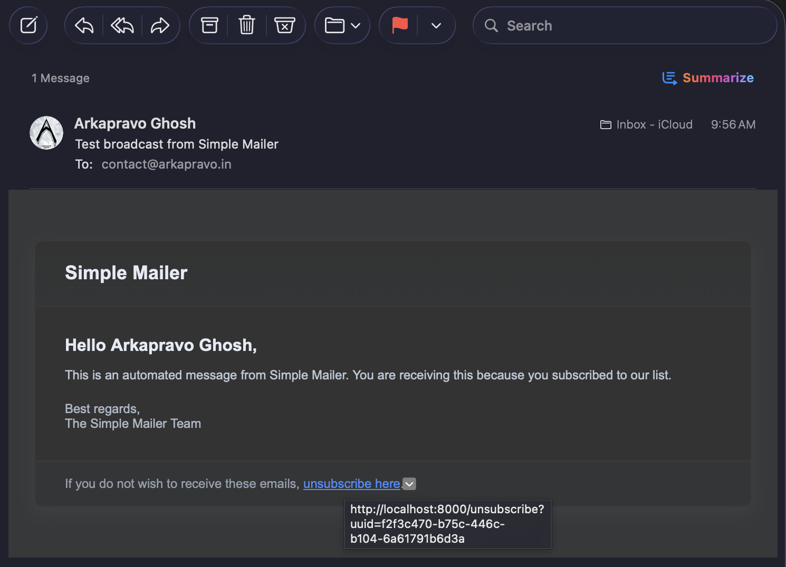

# Simple Mailer

## Description

A minimal mailing-list manager that stores recipients, generates HTML messages, and sends broadcasts via SMTP.

## Sample Mail Preview

## Quick Start

- Install: `npm install`
- Dev: `npm run dev`
- Preview (prod env): `npm run preview`
- Prod build: `npm run build`
- Prod start: `npm start`

## Environment

- `SMTP_HOST`: SMTP host (default: `smtp.gmail.com`)
- `SMTP_PORT`: SMTP port (default: `587`)
- `SMTP_SECURE`: `true|false` (default: `false` — uses STARTTLS)
- `SMTP_USER` / `SMTP_PASS`: SMTP credentials
- `MAIL_FROM`: default From address (optional)
- `BASE_URL`: public base URL used to build unsubscribe links (e.g. `https://example.com`)
- `API_KEY`: admin key for protected endpoints (sent in `x-api-key` or `Authorization: Bearer`)

Config file: [src/configs/mailConfig.ts](src/configs/mailConfig.ts)

## Key Files

- Mail utilities: [src/utils/mailUtils.ts](src/utils/mailUtils.ts)
- Model: [src/models/mailListModel.ts](src/models/mailListModel.ts)
- Services: [src/services/mailServices.ts](src/services/mailServices.ts)
- Controllers: [src/controllers/mailListController.ts](src/controllers/mailListController.ts), [src/controllers/unsubscribeController.ts](src/controllers/unsubscribeController.ts)
- Routers: [src/routers/mailingRouter.ts](src/routers/mailingRouter.ts), [src/routers/unsubscribeRouter.ts](src/routers/unsubscribeRouter.ts)
- HTML helper: [src/helpers/generateHtml.ts](src/helpers/generateHtml.ts)

## API (HTTP)

- `GET /` — health message
- `GET /api/mailing-list` — list recipients (protected)
- `POST /api/mailing-list` — add one or many recipients (protected). Body: array or single `{ name, email }`.
- `PUT /api/mailing-list` — update one or many recipients (protected). Body: item(s) with `id` or `email` and `update`.
- `DELETE /api/mailing-list` — delete one or many by `email`, `_id`, or `uuid` (protected). Body: `{ identifiers: string | string[] }`.
- `POST /api/mailing-list/send` — trigger broadcast send (protected). Body: optional `subject` and `text`. Returns `202` and immediately queues send.
- `GET /unsubscribe?uuid=<uuid>` — public unsubscribe link (no auth) — removes the recipient identified by `uuid`.

## Notes

- Each recipient gets a `uuid` used to identify unsubscribe requests; unsubscribe URLs are generated as `BASE_URL + '/unsubscribe?uuid=' + uuid`.
- The `/send` endpoint performs fire-and-forget sending and returns a `202` with queued count. Delivery errors are logged server-side.
- For REST Client testing, see `src/test`.

## Testing with REST Client

- Use the `.http` files in `src/test` to add/list/send/unsubscribe.
